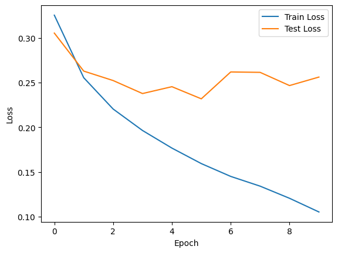
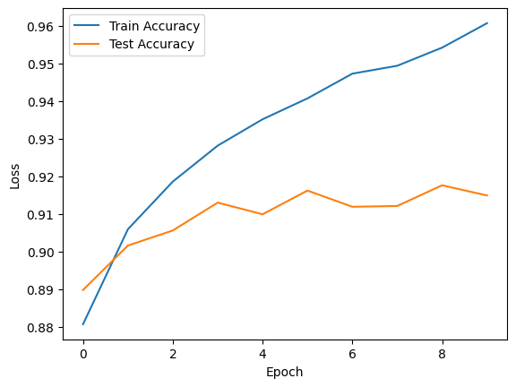
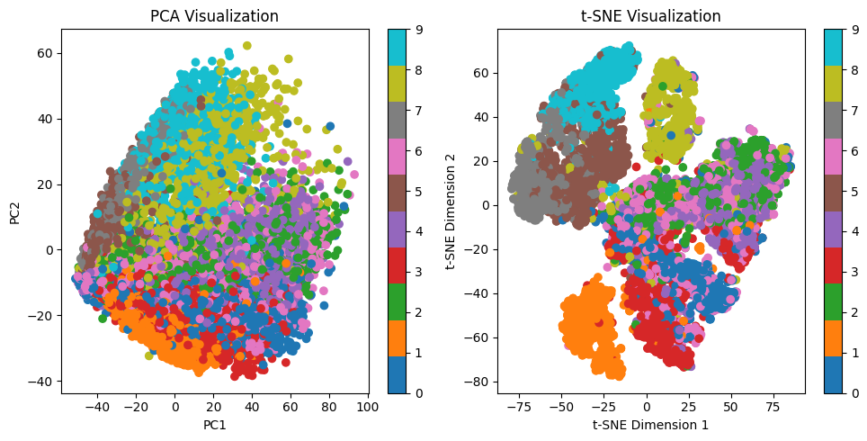
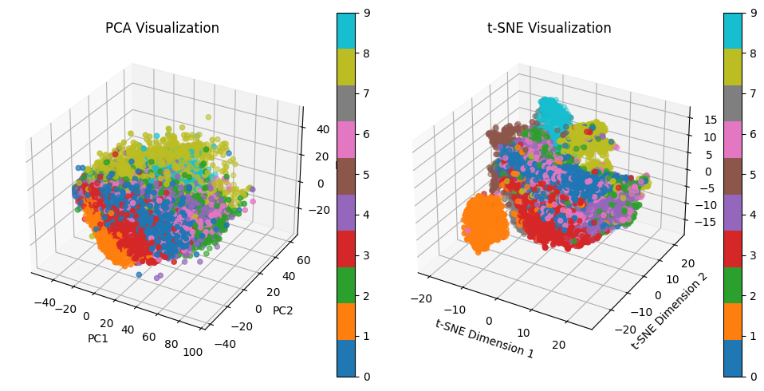
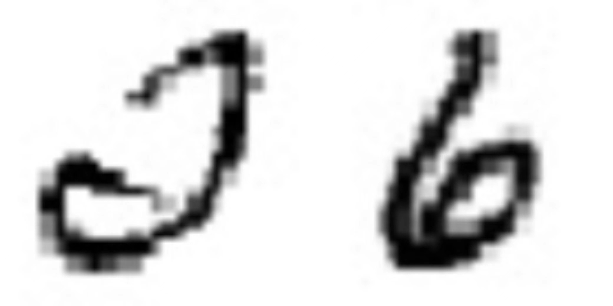
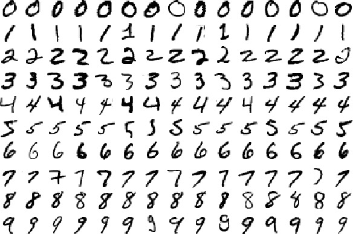
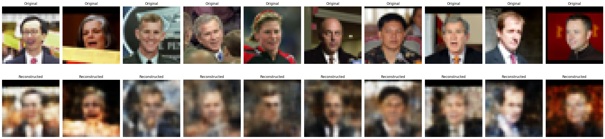
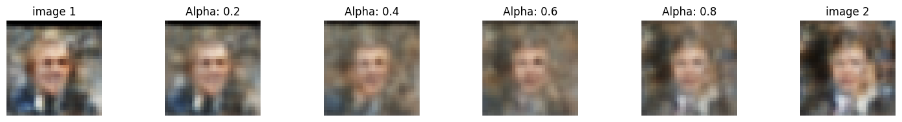

# Machine Learning Final Project

> Author: Kr.Cen 康瑞 岑
> Student ID: 521021910151
> Date: 2023.6.06
> Hint: This is a report for CS3308 Machine Learning final project
>
> You can reach my codes by https://github.com/Kr-Panghu/ML_FinalProject, where I presented the codes and the results in jupyter notebook. Both two parts use Pytorch framework instead of Tensorflow framework.

## Part1: Fashion-MNIST clothing classification

> For this part, I use the data fashion-MNIST (data_required_opt1.zip on canvas).

The DNN designed on my own, I called it **FashionNet**.

~~~py
# The shape of the data:
X_train: (60000, 1, 32, 32)
Y_train: (60000, )
X_test: (10000, 1, 32, 32)
Y_test: (10000, )
~~~

~~~py
class FashionNet(nn.Module):
    def __init__(self):
        super(FashionNet, self).__init__()

        self.conv1 = nn.Conv2d(1, 16, kernel_size=3, stride=1, padding=1)
        self.relu1 = nn.ReLU()
        self.bn1 = nn.BatchNorm2d(16)
        self.pool1 = nn.MaxPool2d(kernel_size=2, stride=2)

        self.conv2 = nn.Conv2d(16, 32, kernel_size=3, stride=1, padding=1)
        self.relu2 = nn.ReLU()
        self.bn2 = nn.BatchNorm2d(32)
        self.pool2 = nn.MaxPool2d(kernel_size=2, stride=2)

        self.conv3 = nn.Conv2d(32, 64, kernel_size=3, stride=1, padding=1)
        self.relu3 = nn.ReLU()
        self.bn3 = nn.BatchNorm2d(64)
        self.pool3 = nn.MaxPool2d(kernel_size=2, stride=2)

        self.conv4 = nn.Conv2d(64, 128, kernel_size=3, stride=1, padding=1)
        self.relu4 = nn.ReLU()
        self.bn4 = nn.BatchNorm2d(128)
        self.pool4 = nn.MaxPool2d(kernel_size=2, stride=2)

        self.fc1 = nn.Linear(128 * 2 * 2, 256)
        self.relu5 = nn.ReLU()
        self.bn5 = nn.BatchNorm1d(256)

        self.fc2 = nn.Linear(256, 128)
        self.relu6 = nn.ReLU()
        self.bn6 = nn.BatchNorm1d(128)

        self.fc3 = nn.Linear(128, 10)

    def forward(self, x):
        x = self.conv1(x)
        x = self.relu1(x)
        x = self.bn1(x)
        x = self.pool1(x)

        x = self.conv2(x)
        x = self.relu2(x)
        x = self.bn2(x)
        x = self.pool2(x)

        x = self.conv3(x)
        x = self.relu3(x)
        x = self.bn3(x)
        x = self.pool3(x)

        x = self.conv4(x)
        x = self.relu4(x)
        x = self.bn4(x)
        x = self.pool4(x)

        x = x.view(x.size(0), -1)
        
        x = self.fc1(x)
        x = self.relu5(x)
        x = self.bn5(x)

        x = self.fc2(x)
        x = self.relu6(x)
        x = self.bn6(x)

        x = self.fc3(x)

        return x

model = FashionNet()
~~~

DNN Structure is drawn as:（Presented in multiple lines for ease of presentation. The layer at the end of the previous line and the layer at the beginning of the next line represent the same layer）

~~~mermaid
graph LR
1(input )--"<1,32,32>"-->2(Conv1\n 3x3)--"<16,32,32>"-->3(ReLU1)-->4(BN1)-->5(Pool1\n kernel=2)--"<16,16,16>"-->6(Conv2)

a(Conv2\n 3x3)--"<32,16,16>"-->7(ReLU2)-->8(BN2)-->9(Pool2\n kernel=2)--"<32,8,8>"-->10(Conv3)

aa(Conv3\n 3x3)--"<64,8,8>"-->11(ReLU3)-->12(BN3)-->13(Pool3\n kernel=2)--"<64,4,4>"-->14(Conv4)

aaa(Conv4\n 3x3)--"<128,4,4>"-->15(ReLU4)-->16(BN4)-->17(Pool4\n kernel=2)--"<128,2,2>"-->18(FC1)

aaaa(FC1\n 512x256)--"<256>"-->19(ReLU5)-->20(BN5)-->21(FC2\n 256x128)--"<128>"-->22(ReLU6)

aaaaa(ReLU6)-->23(BN6)-->24(FC3\n 128x10)--"<10>"-->25(output)
~~~

**Why I implement this architecture?** This is a classical convolutional neural network, for image classification work.

This architecture has several merits:

1. Convolutional layer and pooling layer are used alternately: convolutional layer is used to extract the features of the image, and pooling layer is used to reduce the spatial size of the feature map and extract higher level features. This alternating structure helps the network to abstract and represent images at multiple levels.
2. Batch Normalization: By normalizing the input of each batch in the network, batch normalization layers help speed up the training process of the network and can improve the robustness and generalization ability of the network.
3. Multiple hidden layers: This network has multiple convolutional and fully connected layers, each of which can learn a different level of feature representation. Such a design allows the network to better understand and represent the input data and improve the classification performance.

---

**The training results**:

The test accuracy can reach 92% at most, which is pretty good.

### Intermediate Latent Visualization

Personalized PCA and t-SNE（avoid using sklearn but **numpy**）

~~~python
# Visualization
def personal_pca(X, n_components):
    # 数据矩阵X的均值归零化
    X_mean = np.mean(X, axis=0)
    X_centered = X - X_mean

    # 计算协方差矩阵的特征值和特征向量
    cov_matrix = np.dot(X_centered.T, X_centered)
    eigenvalues, eigenvectors = np.linalg.eig(cov_matrix)

    # 对特征值进行排序
    eigenvectors = eigenvectors[:, np.argsort(-eigenvalues)]
    eigenvalues = eigenvalues[np.argsort(-eigenvalues)]

    # 选择前n个特征向量
    selected_eigenvectors = eigenvectors[:, :n_components]

    # 对原始数据进行降维
    transformed = np.dot(X_centered, selected_eigenvectors)

    return transformed

def personal_tsne(X, n_components, perplexity=30, learning_rate=200, n_iter=1000):
    def compute_pairwise_distances(X):
        sum_X = np.sum(np.square(X), axis=1)
        distances = np.add(np.add(-2 * np.dot(X, X.T), sum_X).T, sum_X)
        return distances

    def compute_perplexity(distances, perplexity=30):
        P = np.zeros((X.shape[0], X.shape[0]))
        beta = np.ones(X.shape[0])
        for i in range(X.shape[0]):
            # 使用二分搜索找到合适的sigma值
            min_beta = None
            max_beta = float('inf')
            for _ in range(50):
                beta_i = beta[i]
                distances_i = distances[i, np.concatenate((np.r_[:i], np.r_[i + 1:X.shape[0]]))]
                probabilities = np.exp(-beta_i * distances_i)
                sum_probabilities = np.sum(probabilities)
                entropy = np.log(sum_probabilities) + beta_i * np.sum(distances_i * probabilities) / sum_probabilities
                entropy_diff = entropy - np.log(perplexity)
                if np.abs(entropy_diff) < 1e-5:
                    break
                if entropy_diff > 0:
                    min_beta = beta_i
                    if max_beta == float('inf'):
                        beta[i] *= 2
                    else:
                        beta[i] = (beta[i] + max_beta) / 2
                else:
                    max_beta = beta_i
                    if min_beta is None:
                        beta[i] /= 2
                    else:
                        beta[i] = (beta[i] + min_beta) / 2
            probabilities /= sum_probabilities
            P[i, np.concatenate((np.r_[:i], np.r_[i + 1:X.shape[0]]))] = probabilities
        return P

    def compute_gradient(P, Y):
        num = P.shape[0]
        PQ_diff = P - Q
        grad = np.zeros((num, n_components))
        for i in range(num):
            grad_i = np.tile(PQ_diff[i] * inv_distances[i], (n_components, 1)).T
            grad[i] = 4 * (grad_i * (Y[i] - Y)).sum(axis=0)
        return grad

    # 初始化Y
    Y = np.random.randn(X.shape[0], n_components)

    # 对称化数据
    X = (X - np.mean(X, axis=0)) / np.std(X, axis=0)

    # 计算欧氏距离的平方
    distances = compute_pairwise_distances(X)

    # 初始化P和Q
    P = compute_perplexity(distances, perplexity)
    P = P + P.T
    P = P / np.sum(P)
    P = P * 4  # early exaggeration
    P = np.maximum(P, 1e-12)

    for iter in range(n_iter):
        # 计算Q
        inv_distances = 1 / (1 + distances)
        np.fill_diagonal(inv_distances, 0)
        Q = inv_distances / np.sum(inv_distances)
        Q = np.maximum(Q, 1e-12)

        # 计算梯度
        dY = compute_gradient(P, Y)

        # 更新Y
        gains = (gains + 0.2) * ((dY > 0) != (iY > 0)) + (gains * 0.8) * ((dY > 0) == (iY > 0))
        gains[gains < 0.01] = 0.01
        iY = learning_rate * gains * dY
        Y = Y - iY

        # 归一化Y
        Y = Y - np.mean(Y, axis=0)

        # 打印迭代进度
        if (iter + 1) % 100 == 0:
            error = np.sum(P * np.log(P / Q))
            print(f"Iteration {iter + 1}: error = {error}")

    return Y
~~~

The following are visualization results:

According to these two graphs, I tried to summarize some empirical conclusions:

1. There are some colors distinct with others. They are $\{1, 3, 8, 9\}$ (especially according to the results of t-SNE visualization). This means they have distinct, unique features that make them stand out and can be distinguished from other numbers. As you can see, for most number $1$, it is just a single stroke; the upper and lower parts of the number $8$ are both a circle, etc.
2. There are some huge overlaps between some colors, like $\{2\and 6 \}$, $\{0\and 6 \}$, etc. We can do this empirically: since the characters $2$ and $6$ have very personal handwriting characteristics, they become similar in some aspects, which means that they become difficult to distinguish correctly. The number $6$, which also contains a **circle**, will also become indistinct from the number $0$ if the number $6$ flattens out or if the stroke outside the circle becomes thin and short.

For reference, here is a partial image of each digit in the MNIST dataset:

## Part2: Image Reconstruction

> For this part, I use the data simplified LFW (data_option1_opt2.zip on canvas).

### VAE Model

VAE Structure:

~~~py
class VAE(nn.Module):
    def __init__(self, latent_dim):
        super(VAE, self).__init__()
        
        self.latent_dim = latent_dim
        
        # Encoder layers
        self.conv1 = nn.Conv2d(3, 16, kernel_size=3, stride=2, padding=1)
        self.conv2 = nn.Conv2d(16, 32, kernel_size=3, stride=2, padding=1)
        self.fc1 = nn.Linear(32 * 8 * 8, 256)
        
        # Latent space layers
        self.fc_mean = nn.Linear(256, latent_dim)
        self.fc_logvar = nn.Linear(256, latent_dim)
        
        # Decoder layers
        self.fc2 = nn.Linear(latent_dim, 256)
        self.fc3 = nn.Linear(256, 32 * 8 * 8)
        self.conv3 = nn.ConvTranspose2d(32, 16, kernel_size=4, stride=2, padding=1)
        self.conv4 = nn.ConvTranspose2d(16, 3, kernel_size=4, stride=2, padding=1)
        
    def encode(self, x):
        x = F.relu(self.conv1(x))
        x = F.relu(self.conv2(x))
        x = x.view(x.size(0), -1)
        x = F.relu(self.fc1(x))
        
        mean = self.fc_mean(x)
        logvar = self.fc_logvar(x)
        
        return mean, logvar
    
    def decode(self, z):
        x = F.relu(self.fc2(z))
        x = F.relu(self.fc3(x))
        x = x.view(x.size(0), 32, 8, 8)
        x = F.relu(self.conv3(x))
        x = torch.sigmoid(self.conv4(x))
        
        return x
    
    def reparameterize(self, mean, logvar):
        std = torch.exp(0.5 * logvar)
        epsilon = torch.randn_like(std)
        z = mean + epsilon * std
        return z
    
    def forward(self, x):
        mean, logvar = self.encode(x)
        z = self.reparameterize(mean, logvar)
        x_recon = self.decode(z)
        return x_recon, mean, logvar
~~~

The following diagram shows the overall architecture of the VAE.

~~~mermaid
graph LR
A[Input Image] --> B[Encoder\n conv1,conv2,fc1\n]
B --> C[Latent Space]
C --> D[Decoder\n fc2,fc3,conv3,conv4]
D --> E[Reconstructed Image]
~~~

Specifically, the architecture of the model is designed as:

- Encoder:

  - The input image is feature extracted and downsampled through convolutional layers **conv1** and **conv2** to reduce the image size.

    **conv1**: nn.Conv2d(3, 16, kernel_size=3, stride=2, padding=1)

    **conv2**: nn.Conv2d(16, 32, kernel_size=3, stride=2, padding=1)

  - The downsampled features are converted to 1D vectors using the flattening operation `x.view(x.size(0), -1)`.

  - 1-D vectors are further transformed into 256-dimensional feature vectors by a fully connected layer `fc1`.

    **fc1**: nn.Linear(32 * 8 * 8, 256), here full connected layer takes in_features as (32,8,8), where 32 is the number of channels 8*8 is the height and width of the feature map, 256 is dimension of output feature.

  - 256-dimensional feature vectors are passed through two fully connected layers `fc_mean ` and `fc_logvarto obtain the mean and variance of the latent space, respectively.

- Latent Space：

  - The mean and variance of the latent space are used to randomly sample the latent vector `z`, using the `reparameterize` function.

- Decoder：

  - The latent vector `z` is transformed through the fully connected layer `fc2` to obtain a 256-dimensional feature vector.
  - The 256-dimensional feature vector is then transformed through the fully connected layer `fc3` to obtain a 32-channel, 8x8 feature map.
  - The feature maps are upsampled and reconstructed layer by layer through deconvolution layers `conv3` and `conv4` to finally obtain a reconstructed image with the same size as the original input image.

As a whole, this VAE model maps an input image to a latent space via an encoder, and then maps the latent vectors back to the reconstructed image via a decoder. This structure allows the model to learn a low-dimensional representation of the data and generate new samples.

### How to implement this model

Hyper-parameter setup.

~~~python
# 定义模型超参数
latent_dim = 120
learning_rate = 0.001
num_epochs = 500
batch_size = 32
~~~

Training process.

~~~python
# 训练模型
total_steps = len(data_loader)
for epoch in range(num_epochs):
    for i, images in enumerate(data_loader):
        # 前向传播
        recon_images, mean, logvar = model(images)
        
        # 计算重构误差和KL散度
        recon_loss = criterion(recon_images, images)
        kl_loss = -0.5 * torch.sum(1 + logvar - mean.pow(2) - logvar.exp())
        
        # 计算总损失
        loss = recon_loss + 1e-5 * kl_loss
        
        # 反向传播和优化
        optimizer.zero_grad()
        loss.backward()
        optimizer.step()
        
        # 打印训练信息
        if (epoch+1) % 10 == 0 and (i+1) % 10 == 0:
            print(f"Epoch [{epoch+1}/{num_epochs}], Step [{i+1}/{total_steps}], Loss: {loss.item():.4f}")
~~~

Here, I employ MSE loss instead of CE loss for **recon_loss** (I have tried both and found that the final visualization using MSE loss is significantly better than CE loss), and the loss function is defined as:

~~~ python
loss = recon_loss + 1e-5 * kl_loss
~~~

I found that if we change the KL loss weight too high, the final images generated by intermediate code will be almost identical. So in this implementation, I decreased the KL loss weight to $10^{-5}$.

### Image Reconstruction

I randomly select some images from the $X\_train$, and reconstruct the images throught the VAE model. By comparing the original and rebuilt images, we can see the effect of the VAE model. The following is one of the results.

It can be seen that the effect of image reconstruction is relatively good, and large color patches can be well distinguished, but there will be an inevitable loss in sharpness, that is, the boundary of the color patch will become blurred.

### Image Reconstruction with Interpolation

Use $\alpha = [0.2, 0.4, 0.6, 0.8]$, for latent code $z_1, z_2$, I rebuild image with each $(1-\alpha) z_1 + \alpha z_2$ as latent code, and visualize the image by matplotlib. The following is one of the results.

Here is an interesting result: when image1 is the face of an old person and image2 is the face of a young person, the intermediate images generated using interpolation by VAE are interesting.
